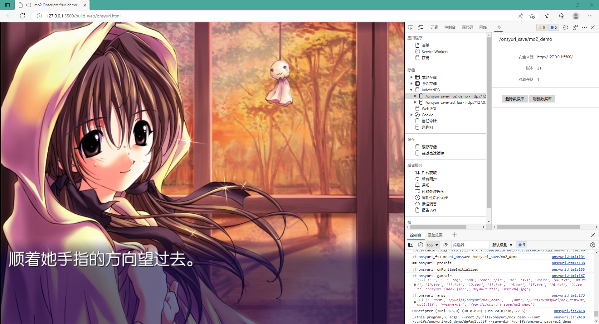
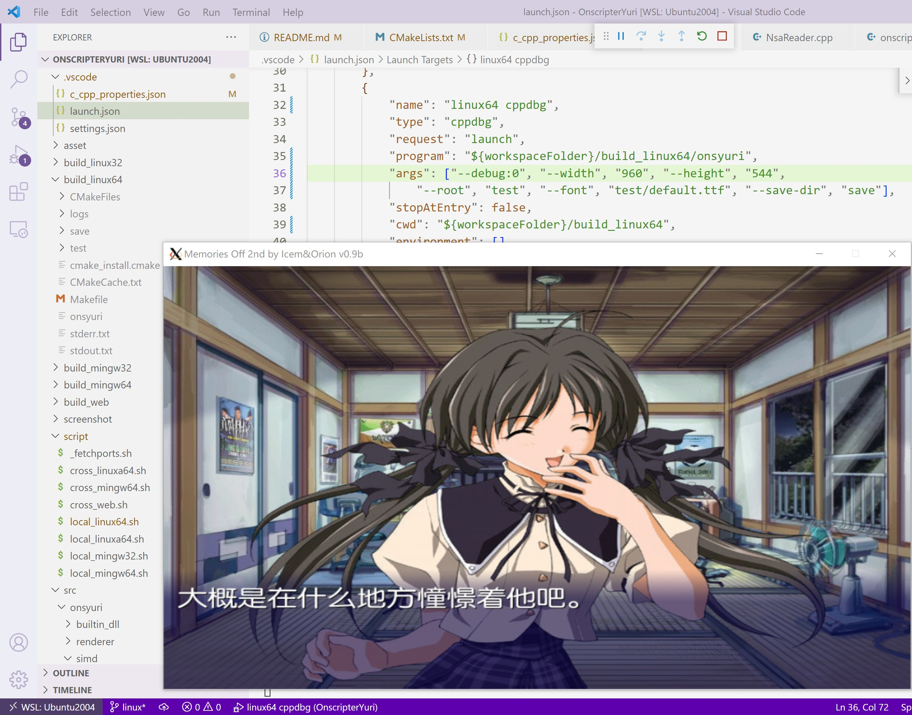
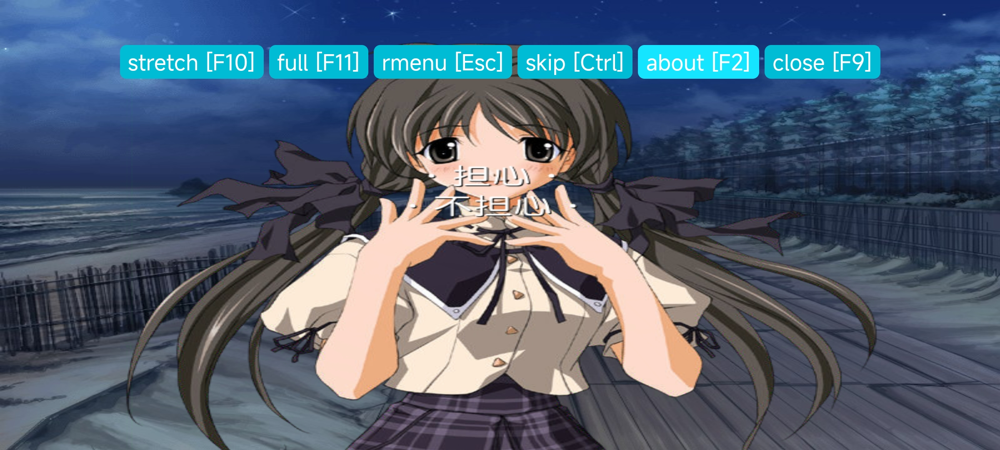
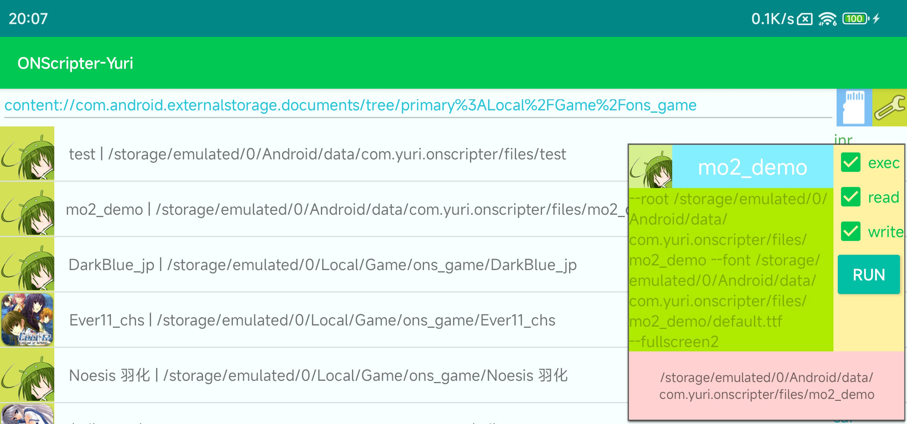
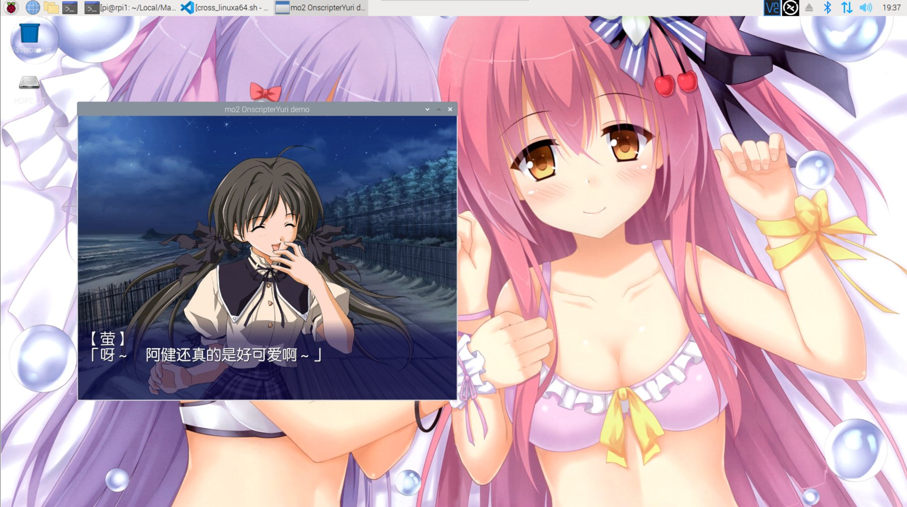

# Onscripter-Yuri  

&logo=firefox&style=flat-square)&&logo=android&style=flat-square)
&logo=mingww64&style=flat-square)&logo=codeblocks&style=flat-square)
&logo=linux&style=flat-square)&logo=apple&style=flat-square)

☘️ An enhancement ONScripter project porting to many platforms, especially **web** ！  
We also support for `windows`, `linux`, `mac`, `android`, `retroarch` and `psv`. This project is base on [ONScripter-Jh](https://github.com/jh10001/ONScripter-Jh) by `SDL2`.

Online Demo: [lifegame](https://onsgame.netlify.app/lifegame/), [luasnow](https://onsgame.netlify.app/luasnow/), [noesis1 (lazyload)](https://onsgame.netlify.app/noesis1/)  
PSV: [psv-OnscripterJH](https://github.com/YuriSizuku/psv-OnscripterJH/releases)  
Android : [Google PlayStore](https://play.google.com/store/apps/details?id=com.yuri.onscripter)  
Multi Platform: [github action release](https://github.com/YuriSizuku/OnscripterYuri/releases)  



New features :  

- script
  - [x] lua script and animation  
  - [x]  support English half-width text, see [Word wrapping](https://github.com/YuriSizuku/OnscripterYuri/issues/2)
  - [x] `nt2`, `nt3` script encryption (Mine exclusive format)
  - [x] long click or touch to invoke menu  

- render
  - [x] fullscreen by `--fullscreen` or `alt+enter`, scretch to fullscreen by `--fullscreen2` or `f10`  
  - [x] arbitary resolution `--width`, `--height`  
  - [x] gles2 sharpness rendering by `--sharpness 1.0` parameter, fix bug on windows

- platform
  - [x] windows
    - [x] x86, x64 (local or cross compile by mingw, static link)  
    - [x] amd64, arm64 (local msvc, vcpkg, contributed by [ryank231231](https://github.com/YuriSizuku/OnscripterYuri/pull/3))
    - [x] video by system player
  - [x] linux
    - [x] x86, x64 (local compile, static or dynamic link)
    - [x] arm, aarch64 (cross compile, SDL2 build from raspberrypi, static link)
    - [x] retroarch (contributed by [iyzsong](https://github.com/iyzsong))
  - [x] mac
    - [x] x64, arm64 (local compile, contributed by [yujincheng08](https://github.com/yujincheng08))
  - [x] web (by emscripten)
    - [x] fs to save in indexdb
    - [x] lazy load by ~~BrowserFS or worker~~ async fetch to avoid block the audio  
    - [x] mobile web with touch, with webui menu
  - [x] android
    - [x] SDK level above 21 (android 5.1, Lolipop)  
    - [x] extern SD card by [SAF](https://github.com/YuriSizuku/android-SafFile), and scoped storage
    - [x] non-english charactor in path
    - [x] video by system player
  - [x] psv, see [psv-Onscripter](https://github.com/YuriSizuku/psv-OnscripterJH)

- bugfix  
  - [x] fix some bugs in origin version (can not read `00.txt` problem)  
  - [x] fix lua animation problem
  - [x] fix android onresume gles null pointer
  - [x] fix android file stat problem (save not found)

- develop
  - [x] clear camke project structure
  - [x] well documention for develop and usage
  - [x] scripts to compile or cross compile without pain
  - [x] vscode and android studio project for multi enviroment
  - [x] ci in github action to automaticly build  
  - [x] use docker to build for all platform

## 1. Usage

### (1) general command

``` bash
./onsyuri --help
./onsyuri --root /path/to/game --save-dir /path/to/save --font /path/default.ttf --enc:sjis
./onsyuri --width 1280 --height 720 --sharpness=3.1
./onsyuri --fullscreen2 # fullscreen1 alt+f, fullscreen2 f10 (toggle stretch)

Usage: onsyuri [option ...]
  -h, --help            show this help and exit
  -v, --version         show the version information and exit

 load options:
  -f, --font file       set a TTF font file
  -r, --root path       set the root path to the archives
      --save-dir        set save dir
      --debug:1         print debug info
      --enc:sjis        use sjis coding script

 render options:
      --window          start in windowed mode
      --width 1280      force window width
      --height 720      force window height
      --fullscreen      start in fullscreen mode (alt+f or alt+enter)
      --fullscreen2     start in fullscreen mode with stretch (f10 to toggle stretch)
      --sharpness 3.1    use gles to make image sharp
      --no-video        do not decode video
      --no-vsync        turn off vsync

 other options:
      --cdaudio         use CD audio if available
      --cdnumber no     choose the CD-ROM drive number
      --registry file   set a registry file
      --dll file        set a dll file
      --enable-wheeldown-advance        advance the text on mouse wheel down
      --disable-rescale do not rescale the images in the archives
      --force-button-shortcut   ignore useescspc and getenter command
      --render-font-outline     render the outline of a text instead of casting a shadow
      --edit            enable online modification of the volume and variables when 'z' is pressed
      --key-exe file    set a file (*.EXE) that includes a key table
      --fontcache       cache default font

```

❗ If you force exit the game, the save might be damaged, try to remvoe envdata to play again.

### (2) linux

You can either download the prebuild static elf from the [release](https://github.com/YuriSizuku/OnscripterYuri/releases) or build from source (see next part).  

  

- Arch User Repository
  
  [aur onscripter-yuri](https://aur.archlinux.org/packages/onscripter-yuri)

``` sh
# for Arch based distributions, install directly from AUR.
yay -S onscripter-yuri
```

### (3) web

This project can run in a browser through hosted web server.  
Press `F10` to strech full in a webpage, `F11` in fullscreen, `F9 | Right Click| Long Click` to invoke menu.

The structure is as bellow:  

``` bash
onsyuri.html
onsyuri.js
onsyuri.wasm
onsyuri_index.json
[your game files]
```

  

It will load the game according to `onsyuri_index.json`, whitch is deifned by `<meta onsyuri_index="onsyuri_index.json">` in `onsyuri.html`.  

``` json
{
  "title": "game1",
  "gamedir": "/onsyuri/game1",
  "savedir": "/onsyuri_save/game1",
  "args": [],
  "lazyload": "true",
  "files":[
    {"path": "0.txt" , "url":"http://localhost:5500/asset/test/0.txt"},
    {"path": "bgm/bgm.ogg" , "url":"http://localhost:5500/asset/test/bgm/bgm.ogg"},
    {"path": "default.ttf" , "url":"http://localhost:5500/asset/test/default.ttf"}
  ]
}

```

This can be generated by `onsyuri_index.py`.

~~Futhremoe, use `make_xhrfs_index > onsyuri_lazyload.json` after `npm i -g browserfs`~~  deprecated.  

### (4) android  

Install the apk, use `3 figures|long touch` for invoke menu, `4 figures` to invoke skip.  
You can either put game into `/storage/emulated/0/Android/data/com.yuri.onscripter/files`, or any directory by `saf`.



## 2. Build

### (1) local windows  

Install the dependency in msys2,  

``` sh
pacman -Syu --noconfirm
pacman -S --noconfirm make tar vim curl # util tools
pacman -S --noconfirm mingw-w64-x86_64-binutils mingw-w64-x86_64-gcc mingw-w64-x86_64-gdb # mingw64 compile tool
pacman -S --noconfirm mingw-w64-i686-binutils mingw-w64-i686-gcc mingw-w64-i686-gdb # mingw32 compile tool

pacman -S --noconfirm mingw-w64-i686-SDL2 mingw-w64-x86_64-SDL2
pacman -S --noconfirm mingw-w64-i686-SDL2_image mingw-w64-x86_64-SDL2_image
pacman -S --noconfirm mingw-w64-i686-SDL2_ttf mingw-w64-x86_64-SDL2_ttf
pacman -S --noconfirm mingw-w64-i686-SDL2_mixer mingw-w64-x86_64-SDL2_mixer

pacman -S --noconfirm mingw-w64-i686-brotli mingw-w64-x86_64-brotli
pacman -S --noconfirm mingw-w64-i686-mesa mingw-w64-x86_64-mesa
pacman -S --noconfirm mingw-w64-i686-lua mingw-w64-x86_64-lua
```

and then use these `local_msys2mingw32.sh` or `local_msys2mingw64.sh` to build.

``` sh
cd script
chmod +x *.sh
sh -c "export BUILD_TYPE=Debug && export MSYS2_HOME=/path/to/msys2 && ./local_msys2mingw32.sh"
```  

### (2) local linux  

Install the dependency  

``` bash
# linux64
sudo apt-get update
sudo apt-get -y install gcc gdb make cmake git curl
sudo apt-get -y install libsdl2-dev libsdl2-ttf-dev libsdl2-image-dev libsdl2-mixer-dev
sudo apt-get -y install libbz2-dev libjpeg-dev libpng-dev
sudo apt-get -y install liblua5.3-dev libgl1-mesa-dev

# linux32
sudo dpkg --add-architecture i386 
sudo apt-get update
sudo apt-get -y install gcc-multilib g++-multilib 
sudo apt-get -y install libsdl2-dev:i386 libsdl2-ttf-dev:i386 libsdl2-image-dev:i386 libsdl2-mixer-dev:i386
sudo apt-get -y install libbz2-dev:i386 libjpeg-dev:i386 libpng-dev:i386
sudo apt-get -y install liblua5.3-dev:i386 libgl1-mesa-dev:i386
```  

``` sh
cd script
chmod +x *.sh
sh -c "export BUILD_TYPE=Debug && ./local_linux32.sh"
```  

and then use `local_linux32.sh` or `local_linux64.sh` to build.  

### (3) cross web  

Install [emsdk](https://github.com/emscripten-core/emsdk) and use `cross_web.sh` to build.  

``` shell
cd script
chmod +x *.sh
sh -c "export BUILD_TYPE=Debug && export EMCSDK=/path/to/emsdk && ./cross_web.sh"
```

### (4) cross linux arm

This is aimed for raspberrypi or the other arm64 devices cross compiling.
As there are many system bindings in SDL2,  
just build libraries in the target machine, and use these build cache to link.  
Or you can use `docker_linuxarm64.sh` for cross compile.  



Install the dependency for aarch64 cross compiler,  

``` shell
# install in the target machine, aarch64
sudo apt-get -y install libx11-dev libxext-dev libasound2-dev 
sudo apt-get -y install libgl1-mesa-dev mesa-utils

# install in the target machine, armhf (if you want to run armhf in aarch64)
sudo dpkg --add-architecture armhf && sudo apt-get update
sudo apt-get -y install libc6:armhf 
sudo apt-get -y install libx11-dev:armhf libxext-dev:armhf libasound2-dev:armhf 
sudo apt-get -y install libgl1-mesa-dev:armhf mesa-utils:armhf

# install in the local machine
sudo apt-get -y install tar make cmake curl git
sudo apt-get -y install crossbuild-essential-armhf
sudo apt-get -y install crossbuild-essential-arm64
```

then use `cross_linuxa64.sh` or `cross_linuxa32.sh` to compile.  

```shell  
# at first build sdl2 in raspberry pi
sh -c "export SYSROOT=/ && ./local_linux64.sh"

# copy prebuild of dependency to local
cp -rf /path/to/rpi/OnscripterYuri/thirdparty/build/arch_aarch64 thirdparty/build/arch_aarch64

# use SKIP_PORTS to skip thirdpart builds
cd script
chmod +x *.sh
sh -c "export BUILD_TYPE=Debug && export SKIP_PORTS=yes && ./local_linux64.sh"
```  

### (5) cross mingw  

Install mingw cross compiler and tools (debain and wsl2 tested)

``` shell  
sudo apt-get -y install tar make cmake curl git
# use pkg-config is to find sdl2 by compiling sdl2_image, do not install mingw-w64-tools, this pkg-config is broken
sudo apt-get -y install mingw-w64 zstd pkg-config 
```

then use `cross_mingw32.sh` or `cross_mingw64.sh` to compile.

### (6) cross llvmmingw  

Download [llvm-mingw](https://github.com/mstorsjo/llvm-mingw/releases/tag/20240619) and add `${MINGWSDK_HOME}/bin` to path,  

then use `cross_llvmmingw32.sh` or `cross_llvmmingw64.sh` to compile (either `bash (git bash)` or `msys2 shell`).

### (7) cross android  

Install android sdk and ndk, then

``` sh
# prepare port dependencies
cd script
sh ./cross_android.sh 
cd -

# use ANDROID_HOME or local.properties for sdk
cd src/onsyuri_android/
chmod +x ./gradlew && ./gradlew assembleDebug
```

### (8) cross by docker  

You can easily build all supported platforms by docker, see `docker/docker_xxx.sh` in detail.
If you want to build for linux arm in x86 platform, install qemu at first.  

```  shell
sudo apt-get install qemu-user-static binfmt-support
```

## 3. Compatibility  

|game|version|status|description|
|----|-------|------|-----------|

## 4. Issues (including already solved)  

- general  
  - ~~release file too big~~; This is because of static link all libraries for better compatibility. Partly solved by recomiple SDL libraries.  
- windows  
  - ~~windows fullscreen aliasing~~; This is because window high dpi scale problem, use `change high dpi setting` or edit reg as below:  
  
  ```bat
  set app_name=onsyuri.exe
  reg add "HKCU\SOFTWARE\Microsoft\Windows NT\CurrentVersion\AppCompatFlags\Layers" /t reg_sz /v "%~dp0%app_name%" /d "~ HIGHDPIAWARE" /f
  ```  

- linux  
- android  
- web  
  - ~~lazy load in workerfs not work, see this [issue](https://github.com/emscripten-core/emscripten/issues/18698)~~ ; solved by using [BrowserFS](https://github.com/jvilk/BrowserFS)
  - ~~Audio glitch problem in slow network~~ ; solved by async fetch without blocking audio
  - SDL2 Mix_LoadMUS can not decode mp3

## 5. Todo  

- ~~video support (future plan)~~  partly finish by invoke system player  
- ~~web preloading (future plan)~~ might not need ? lazyload partly solved
